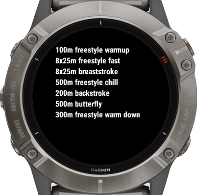

# Workout Note data field

Enhance your workout experience with the customizable workout note data field.

<p align="center">
  
</p>

## Setup
1. Visit the [ConnectIQ Store](https://apps.garmin.com/).
2. Search for the "Workout Note Data Field" application.
3. Install the application and synchronize it with your Garmin device.
4. In the application settings, customize the "Workout Note" field according to your preferences.
5. Configure your activity to utilize the "Workout Note Data Field" (it is recommended to use a 1-field layout for optimal display).
6. Enjoy


## Garmin lack of support of newlines
Unfortunately, Garmin does not provide support for multi-line text input. This application addresses newline handling by introducing a `newLineIndicator`. By default, it is set as the `-` character, but feel free to customize it in the application configuration.

Any occurrence of the specified character will be treated as a new line. For example, if the note contains the value "-first line-second line," it will be displayed as:
```
first line
second line
```

Feel free to tailor this setting to better suit your preferences.
